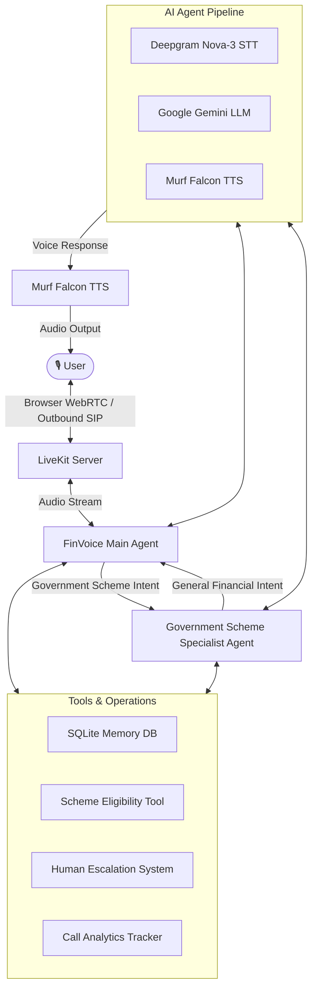

# FinVoice — AI Voice Agent for Financial Services

FinVoice is a voice-first AI financial assistant built as part of the **10 Days of AI Voice Agents — VoiceForBharat Edition** challenge. Powered by **Murf Falcon** TTS and **LiveKit** real-time communication, FinVoice delivers ultra-low-latency, multilingual financial guidance, digital safety education, and government scheme eligibility evaluations to Indian citizens.

---

## About the Project


### What FinVoice Is
FinVoice is an AI-driven voice agent designed to provide conversational financial support and literacy. It allows users to ask financial questions, explore welfare scheme eligibility, and get guidance in natural spoken language.

### What Problem It Solves
Millions of citizens in India face barriers to accessing essential financial information due to complex documentation, language constraints, and digital literacy gaps. FinVoice bridges this gap by providing an accessible, voice-first interface that speaks in regional languages/dialects (English, Hindi/Hinglish, Telugu/Tenglish) and explains complex financial concepts simply.

### Who It Is Designed For
FinVoice is designed for Indian citizens, particularly first-time digital banking users, rural landholders, small business owners, and families seeking clear information on financial services, digital payment safety, and central government welfare schemes.

### Why Voice Interaction Is Useful
Voice interaction removes the friction of typing, searching dense websites, or navigating complicated app menus. Users can simply speak naturally, ask questions, and receive concise, human-like voice responses with sub-second latency.

### Challenge Background
This project was built over 10 days during the **10 Days of AI Voice Agents — VoiceForBharat Edition** challenge, progressing step-by-step from a basic text-to-speech voice pipeline to a complete multi-agent, memory-enabled, tool-equipped financial support system.

---

## Key Features

- **Real-time browser voice conversation**: Ultra-low-latency dual-directional voice communication powered by LiveKit Agents and Murf Falcon TTS (`en-IN-anusha` voice).
- **Indian / multilingual voice interaction**: Natural speech interaction supporting English, Romanized Hindi (Hinglish), and Romanized Telugu (Tenglish).
- **Agent personality and safety guardrails**: Friendly, empathetic financial assistant with strict guardrails—never asks for or stores OTPs, PINs, CVVs, passwords, Aadhaar, or bank account numbers.
- **User memory**: Persistent SQLite user memory with explicit consent gating prior to saving user profile facts or language preferences.
- **Financial tools and eligibility checks**: Integrated local rule-based eligibility evaluation engine for major government financial schemes.
- **Outbound SIP calling**: SIP telephony capabilities allowing proactive outbound call workflows (e.g., scheme deadline reminders).
- **Human escalation**: Automated escalation ticketing workflow with user consent for suspected fraud reports or requests exceeding automated scope.
- **Call analytics dashboard**: Dedicated real-time monitoring interface tracking call volume, duration, channels, and outcomes.
- **Successful / failed call tracking**: Real-time logging of call success rates, error statuses, and failure reasons stored in SQLite.
- **Government Scheme Specialist Agent**: Dedicated specialist agent optimized specifically for Indian government welfare and savings schemes.
- **Main Agent → Specialist Agent handoff**: Dynamic, seamless agent handoff from the main financial agent to the specialist agent upon detecting scheme-related intent.
- **Context preservation during handoff**: Carries over user intent, requested scheme details, and session identifiers during transfer so users never have to repeat themselves.

---

## 10-Day Journey

| Day | What I Built |
|-----|--------------|
| Day 1 | **Get Your Voice Agent Talking** — Base real-time voice pipeline integrating LiveKit transport and Murf Falcon TTS. |
| Day 2 | **Personality, Job, Limits** — Persona definition, core financial mission, strict safety guardrails, and multilingual prompt engineering. |
| Day 3 | **Personalized FinVoice Frontend** — Custom Next.js web application with audio visualizers, live transcript, and theme customization. |
| Day 4 | **Memory for Returning Users** — SQLite-backed persistent memory, returning caller greetings, consent protocol, and sensitive-data blocklist. |
| Day 5 | **Tools** — Custom financial eligibility checker tool evaluating criteria across 7 central government schemes based on non-sensitive inputs. |
| Day 6 | **Outbound Phone Calls** — Outbound SIP telephony integration via LiveKit SIP trunks for proactive caller engagement. |
| Day 7 | **Continue the voice-agent workflow / improvements** — Consent-gated human escalation center, fraud evaluation tool, and escalation management UI. |
| Day 8 | **Call Analytics Dashboard** — Full-stack analytics tracking system with SQLite storage, real-time polling, and success rate KPI metrics. |
| Day 9 | **Government Scheme Specialist Agent + Handoff** — Specialized sub-agent routing, context preservation, and bidirectional handoff capability. |
| Day 10 | **Documentation and Voice Agent Journey** — Complete repository documentation, architecture overview, setup guides, and project retrospective. |

---

## Architecture



---

## Tech Stack

- **Language & Runtime**: Python 3.10+ (managed via `uv`), TypeScript / Node.js
- **Frontend Framework**: Next.js 15, React 19, Tailwind CSS v4
- **Real-time Audio Transport**: LiveKit Client SDK, LiveKit Agents SDK, WebRTC
- **Text-to-Speech (TTS)**: Murf Falcon (`livekit-murf`, `en-IN-anusha` voice)
- **Speech-to-Text (STT)**: Deepgram Nova-3 (`livekit-agents[deepgram]`)
- **Language Model (LLM)**: Google Gemini 3.5 Flash Lite (`livekit-agents[google]`)
- **Voice Activity Detection**: Silero VAD (`livekit-agents[silero]`)
- **Database**: SQLite (`finvoice_memory.db`)
- **Telephony**: LiveKit SIP Trunking, Linphone SIP client support

---

## Project Structure

```
murf-livekit-starter/
├── backend/                              # Python voice agent backend
│   ├── src/
│   │   ├── agent.py                      # Main FinVoice Agent, Specialist Agent & tool definitions
│   │   ├── memory_db.py                  # SQLite database wrapper (memory, escalations, analytics)
│   │   ├── schemes_checker.py            # Financial scheme eligibility logic & rule engine
│   │   ├── schemes_data.json             # Official government scheme rules dataset
│   │   └── telephony/
│   │       └── outbound/
│   │           ├── agent.py              # Outbound SIP telephony voice agent worker
│   │           └── dial.py               # Outbound SIP call trigger script
│   ├── tests/
│   │   ├── test_agent.py                 # Integration & safety evaluation tests
│   │   ├── test_day5_eligibility.py      # Scheme eligibility unit tests
│   │   ├── test_day7_escalation.py       # Human escalation unit tests
│   │   └── test_day9_handoff.py          # Specialist handoff & context preservation tests
│   ├── check_analytics.py                # CLI utility to view call analytics database
│   ├── finvoice_memory.db                # Persistent SQLite database file
│   └── pyproject.toml                    # Python project dependencies & tool configuration
├── docs/                                 # Project documentation assets
│   └── images/                           # README screenshots
│       ├── finvoice-home.png             # Main Voice Agent UI screenshot
│       ├── analytics-dashboard.png       # Call Analytics Dashboard screenshot
│       └── escalation-center.png         # Escalation Management UI screenshot
├── frontend/                             # Next.js web interface & dashboard
│   ├── app/
│   │   ├── page.tsx                      # Main interactive voice agent interface
│   │   ├── analytics/page.tsx            # Real-time Call Analytics Dashboard
│   │   ├── escalations/page.tsx          # Human Escalation Management Center
│   │   └── api/
│   │       ├── analytics/                # Call analytics REST API endpoints
│   │       ├── escalations/              # Escalation ticket REST API endpoints
│   │       └── token/                    # LiveKit token generation endpoint
│   ├── components/                       # Visualizer, transcript, & UI components
│   ├── lib/
│   │   └── db_helper.py                  # Database bridge for Next.js API routes
│   └── package.json                      # Frontend Node.js dependencies
├── start_app.ps1                         # PowerShell script to start all services (Windows)
├── start_app.sh                          # Bash script to start all services (Linux/macOS)
├── livekit-server.exe                    # Local development LiveKit binary
└── README.md                             # Project documentation
```

---

## Call Analytics


The Day 8 **Call Analytics Dashboard** (`/analytics`) provides operational visibility into agent usage based on real call metrics logged directly to the SQLite database (`call_analytics` table).

### Metrics Tracked
- **Total Calls**: Overall number of voice sessions initiated across browser and SIP channels.
- **Successful Calls**: Count of call sessions completed normally without fatal connection or runtime errors.
- **Failed Calls**: Count of calls interrupted by errors, timeouts, or system failures.
- **Success Rate**: Dynamically calculated percentage of successful calls relative to total volume.
- **Recent Calls Table**: Detailed log displaying Call ID, Timestamp, Duration (seconds), Channel (`browser` / `sip`), Outcome (`success` / `failed`), and Failure Reason (if any).

*Note: All analytics are generated from live database entries and strictly exclude any caller-sensitive information.*

---

## Specialist Handoff

FinVoice implements an intelligent multi-agent system introduced on Day 9:

```
[ User Interaction ]
         │
         ▼
[ FinVoice Main Agent ] ────(Ask Scheme Query)────► [ Government Scheme Specialist ]
         ▲                                                       │
         └───────────(Ask General Banking Query)─────────────────┘
```

- **Specialist Scope**: The **Government Scheme Specialist Agent** focuses exclusively on Indian central welfare schemes (e.g., Sukanya Samriddhi Yojana, PM Kisan, Atal Pension Yojana, PM Mudra Loan, PM Jan Dhan Yojana, PMJJBY, PMSBY).
- **Handoff Mechanism**: When a user asks scheme-related questions, the Main Agent announces the transfer and invokes `transfer_to_government_scheme_specialist`. The specialist takes over the LiveKit session seamlessly.
- **Context Preservation**: The user's initial question, mentioned scheme name, user identity, and preferred language are passed to the specialist's instructions during handoff, preventing repetitive questioning.
- **Handback Support**: If the caller shifts back to general banking (e.g., credit scores, FD rates), the specialist invokes `transfer_back_to_main_agent`.
- **Human Escalation Continuity**: Human escalation (`create_escalation`) remains available in both agents if a human specialist is requested or required.


---

## Setup

### Prerequisites
- Python 3.10+ with `uv` installed (`pip install uv` or via standalone installer)
- Node.js 18+ and `pnpm` installed (`npm install -g pnpm`)
- LiveKit Cloud account (or local `livekit-server`)
- API Keys for **Murf AI**, **Deepgram**, and **Google Gemini**

### Installation & Launch Steps

1. **Clone the repository**:
   ```bash
   git clone https://github.com/murf-ai/murf-livekit-starter.git
   cd murf-livekit-starter
   ```

2. **Install Backend & Frontend Dependencies**:
   ```bash
   # Backend
   cd backend
   uv sync
   cd ..

   # Frontend
   cd frontend
   pnpm install
   cd ..
   ```

3. **Configure Environment Variables**:
   Create `.env.local` files in both `backend/` and `frontend/` based on their respective `.env.example` templates.

4. **Start the Application**:
   - **Windows (PowerShell)**:
     ```powershell
     .\start_app.ps1
     ```
   - **Linux / macOS**:
     ```bash
     chmod +x start_app.sh
     ./start_app.sh
     ```

5. **Open Local Frontend**:
   - Main Agent Interface: `http://localhost:3000`
   - Call Analytics Dashboard: `http://localhost:3000/analytics`
   - Escalation Center: `http://localhost:3000/escalations`

---

## Environment Variables

### Backend (`backend/.env.local`)
```env
LIVEKIT_URL=wss://your-project.livekit.cloud
LIVEKIT_API_KEY=your_livekit_api_key_here
LIVEKIT_API_SECRET=your_livekit_api_secret_here

MURF_API_KEY=your_murf_api_key_here
DEEPGRAM_API_KEY=your_deepgram_api_key_here
GOOGLE_API_KEY=your_google_api_key_here

# Optional: Outbound Telephony
# LIVEKIT_SIP_OUTBOUND_TRUNK_ID=your_sip_trunk_id
# LINPHONE_SIP_URI=sip:user@sip.linphone.org
```

### Frontend (`frontend/.env.local`)
```env
LIVEKIT_URL=wss://your-project.livekit.cloud
LIVEKIT_API_KEY=your_livekit_api_key_here
LIVEKIT_API_SECRET=your_livekit_api_secret_here
```

> ⚠️ **WARNING**: NEVER commit `.env.local` files or confidential API keys to Git. Keep credentials safe and private.

---

## How to Test

### Example Test Scenarios

1. **Normal Financial Question**:
   - *User*: "What is a credit score and why is it important?"
   - *Expected Behavior*: Main FinVoice Agent answers directly using conversational, plain English/Hinglish without triggering scheme tools or agent handoffs.

2. **Government Scheme Question (Handoff Test)**:
   - *User*: "Am I eligible for Sukanya Samriddhi Yojana?"
   - *Expected Behavior*: Main Agent announces connection to specialist -> transfers session -> Specialist Agent greets caller -> checks required facts (girl child age) -> calls `check_scheme_eligibility` tool -> provides clear eligibility response.

3. **Human Escalation (Fraud Report)**:
   - *User*: "I got a suspicious call asking for my bank PIN and money transfer."
   - *Expected Behavior*: Agent identifies potential fraud risk -> asks user for explicit permission to escalate -> upon agreement, generates reference ID (e.g., `FIN-2026-0001`) -> logs sanitized record in SQLite `escalations` table.

---

## Day-by-Day Branches

This repository maintains Git branch records corresponding to each stage of the 10-day challenge:

- `day1`: Base voice agent with LiveKit and Murf Falcon TTS
- `day2`: FinVoice persona, financial objectives, and security rules
- `day3`: Custom Next.js financial frontend interface
- `day4`: SQLite persistent memory database and user consent flow
- `day5`: Scheme eligibility evaluation tool integration
- `day6`: Outbound SIP phone call infrastructure
- `day7`: Human escalation workflow and escalation dashboard
- `day8`: Operational call analytics dashboard
- `day9`: Government Scheme Specialist Agent and handoff system
- `day10`: Project documentation, journey summary, and final polish

---

## Challenges and Learnings

- **Latency & Streaming Optimization**: Fine-tuning text tokenization sentence boundaries (`min_sentence_len=20`) in Murf Falcon TTS was critical to achieving conversational response speed.
- **Multilingual Pronunciation**: Direct Devanagari script output occasionally caused speech engine mispronunciation; Romanized scripts (Hinglish/Tenglish) provided significantly cleaner voice output.
- **Context Preservation**: Managing state transfers during agent switching (`session.update_agent`) required careful instruction engineering so the incoming specialist immediately knew what the caller asked.
- **Privacy & Safety Gating**: Implementing hard blocklists against storing sensitive authentication details (PIN, OTP, CVV) ensured user privacy remains protected even when users accidentally mention confidential numbers.

---

## Privacy & Security

FinVoice strictly follows data privacy principles:
- **No Sensitive Credential Collection**: FinVoice will never ask for, collect, or store OTPs, ATM/UPI PINs, CVVs, account passwords, full account numbers, or Aadhaar numbers.
- **Consent-First Storage**: User memory (`save_user_memory`) and escalation ticket creation (`create_escalation`) strictly require explicit verbal or text user consent before writing records.
- **Data Sanitization**: Summaries stored in escalation tickets automatically redact numeric patterns and sensitive keywords.
- **No Private Secrets in Repository**: Database files containing user data and local `.env.local` credential files are excluded from public source control via `.gitignore`.

---

## Future Improvements

- **Expanded Multilingual Voice Engine**: Direct support for native regional scripts using localized TTS models.
- **Live Scheme Data APIs**: Integrating live government portal APIs (`myscheme.gov.in`) for real-time rule updates.
- **Advanced Telephony Capabilities**: Automated inbound IVR routing and multi-party conference escalation.
- **Calculators & Tools**: Adding instant voice-driven EMI, SIP, and compound interest calculators.
- **Latency Monitoring Metrics**: Incorporating end-to-end audio latency tracking in the analytics dashboard.

---

## Project Links

- **GitHub Repository**: [FinVoice Repository](https://github.com/murf-ai/murf-livekit-starter)
- **Demo Video**: *(Demo link placeholder)*
- **LinkedIn / Day 10 Blog**: *(Blog post link placeholder)*

---

## 10 Days of AI Voice Agents — VoiceForBharat Edition

Building FinVoice over 10 days demonstrated the power of real-time AI voice technology for social and financial inclusion. Using **Murf Falcon** TTS and LiveKit Agents, we built an assistant that not only talks fast and sounds natural, but actively helps citizens navigate banking, avoid financial frauds, and discover government welfare schemes.

Special thanks to **Murf AI** and the **VoiceForBharat** initiative for organizing this 10-day challenge!
